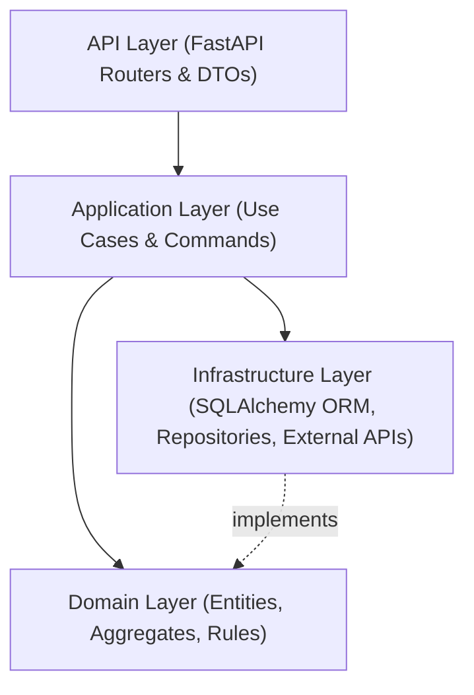

# 🛍️ FastAPI E-Commerce Core

> High-performance, domain-driven E-Commerce core engine built with **FastAPI**, **SQLAlchemy 2.0 (Async)**, and **PostgreSQL/SQLite**.

Designed with **Clean Architecture** and **Domain-Driven Design (DDD)** principles, this repository is engineered to solve real-world e-commerce backend challenges: strict inventory concurrency (`SELECT FOR UPDATE`), immutable order price snapshotting, idempotent checkout transactions, and sub-second catalog queries.

---

## ⚡ Key Architectural Highlights

- **Modern Async Stack**: Python 3.12+, FastAPI, SQLAlchemy 2.0 (Async Engine), and Pydantic v2.
- **Clean Architecture**: Strict decoupling into `domain`, `application`, `infrastructure`, and `api` layers following the Dependency Inversion Principle.
- **Zero-Overselling Concurrency**: Pessimistic row-locking and reservation TTL patterns for high-load checkout rushes.
- **Financial & Data Precision**: Strict `NUMERIC/DECIMAL` arithmetic for currency, Alembic schema versioning, and state-machine transitions.
- **Database Flexibility**: Zero-overhead local testing via SQLite Async (`aiosqlite`) with seamless production migration to PostgreSQL (`asyncpg`).

---

## 🏗️ Architecture & Dependency Flow



- **Domain Layer**: Contains enterprise business rules, entities, and repository interfaces. Has zero framework dependencies.
- **Application Layer**: Orchestrates use cases, commands, queries, and business workflows.
- **Infrastructure Layer**: Implements persistence (SQLAlchemy models, database migrations), caching, and external integrations.
- **API Layer**: Exposes HTTP endpoints, dependency injection, and request/response validation.

---

## 📁 Project Structure

```text
src/
├── domain/                  # Enterprise business rules & entities (Zero framework dependencies)
│   └── catalog/             # Product, Variant, and Attribute domain models
├── infrastructure/          # Database ORM, migrations, external integrations
│   └── database/            # SQLAlchemy 2.0 declarative models & sessions
├── application/             # Use cases & command handlers (Orchestration)
│   └── catalog/             # Catalog services & queries
├── api/                     # External delivery mechanism
│   ├── v1/                  # Versioned API routers & Pydantic DTOs
│   └── dependencies.py      # Dependency injection (Async Session, Auth)
└── core/                    # Engine configurations & settings
```

---

## ⚙️ Environment Configuration

Configuration is managed via `pydantic-settings` and loaded from a `.env` file at the project root.

| Variable | Type | Default | Description |
| :--- | :--- | :--- | :--- |
| `PROJECT_NAME` | `string` | `FastAPI E-Commerce Core` | Application name displayed in API documentation |
| `DEBUG` | `boolean` | `true` | Debug mode toggle |
| `DATABASE_URL` | `string` | `sqlite+aiosqlite:///./ecommerce.db` | Async database connection string |
| `DATABASE_ECHO` | `boolean` | `true` | Log raw SQL queries to console |

---

## 🛠️ Quickstart

### 1. Prerequisites
- **Python**: 3.12 or higher
- **Virtual Environment**: `venv` / `poetry` / `uv`

### 2. Setup & Installation
```bash
# Clone repository
git clone <repo-url>
cd fastapi-ecommerce-core

# Create and activate virtual environment
python -m venv .venv
source .venv/bin/activate       # On Linux/macOS
.venv\Scripts\activate          # On Windows PowerShell

# Install dependencies
pip install -r requirements.txt
```

### 3. Environment & Database Setup
```bash
# Copy example environment configuration
cp .env.example .env

# Apply database migrations
alembic upgrade head
```

### 4. Run Development Server
```bash
uvicorn src.api.main:app --reload --port 8000
```

Once running, interactive documentation is available at:
- **Swagger UI**: [http://localhost:8000/docs](http://localhost:8000/docs)
- **ReDoc**: [http://localhost:8000/redoc](http://localhost:8000/redoc)

---

## 🧪 Testing & Code Quality

```bash
# Run test suite with pytest-asyncio
pytest -v

# Run tests with coverage report
pytest --cov=src tests/
```
